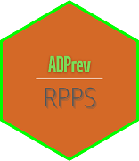

# ADPrev - Análise de Dados Previdenciários dos RPPS 

O objetivo do pacote é facilitar o uso dos dados previdenciários dos RPPS
diponibilizados pela Subsecretaria dos Regimes Próprios de Previdência Social - SRPREV
por intermédio da [API](https://apicadprev.economia.gov.br/api-docs/) mantida com esse objetivo.

Para tanto o pacote oferece além de um conjunto de funções para extração dos dados da
API e limpeza dos mesmos, funções que facilitam a realização de tarefas rotineiras
quando se deseja **acompanhar a gestão dos RPPS**. Esse é, em essência, o objetivo 
principal do pacote: prover ferramentas que facilitem o acompanhamento da gestão dos RPPS.

Grande parte dos dados disponibilizados pela API no presente momento provêm dos
seguintes demonstrativos:

* DAIR - Demonstrativo das Aplicações e Investimentos dos Recursos
* DIPR - Demonstrativo de Informações Previdenciárias e Repasses
* DRAA - Demonstrativo de Resultados da Avaliação Atuarial 

Além disso, também é possível obter dados relativos às **alíquotas de contribuição praticadas
pelos RPPS**, a **relação dos entes federativos com informações sobre a qual regime
previdenciário estão vinculados** e **informações sobre o Certificado de Regularidade 
Previdenciária - CRP**.

Espera-se que num futuro próximo, a API disponibilize também dados relativos ao **DPIN**,
aos **Fluxos Atuariais**, aos **Termos de Parcelamento de Débitos** e às
**Compensações Previdenciária - COMPREV** as quais são informações extremamente relevantes
para um efetivo acompanhamento da gestão dos RPPS.


## Instalação

O pacote pode ser instalado através do GitHub utilizando o seguinte código em R:

```
# install.packages("devtools")
devtools::install_github("marcosfs2006/ADPrev")
library(ADPrev)
```

## Como usar?

Exemplos de uso do pacote com as funções já disponíveis podem ser consutados no link a seguir:

https://colab.research.google.com/drive/10i70YGMjyBub3IQoc5oQHZWMu0bTuNKK?usp=sharing

## _Status_ 

O pacote está ainda em estágio bem inicial de desenvolvimento. As funções ainda estão sendo
desenvolvidas, testadas e modificadas.

Para acompanhar o desenvolvimento do pacote consulte o link:

https://colab.research.google.com/drive/1gbKdLspQbgLurmjmHondnkcZ73KXhE9-?usp=sharing

## Como contribuir

Contribuições são bem-vindas. Basta fazer um _pull request_ no repositório do pacote. Os interessados
em colaborar também podem me encaminhar email se desejarem.

## Licença

[MIT](https://choosealicense.com/licenses/mit/)
